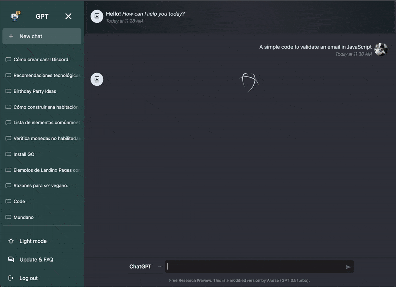

# ChatGPT 3.5 Turbo with DALL·E image generation model
This is a version of ChatGPT that has characteristics similar to those of the chat created by OpenAI, only now you can have it in your local or production environment and modify it to your liking.
- Firebase authentication so you must create an app there (free).
- Stores chat rooms and messages with MySQL.
- Remember the conversations to have a context of them.
- You can have multiple chat rooms.
- Light/Night mode.
- Responsive design for smartphones.



## Install

### Client
```bash
cd client && npm i
```
### Server
```bash
cd server
go mod download
```

## Configuration
### Server
1. Obtain your openai api key from [here](https://openai.com)
2. `cd goserver`
3. Copy `.env.example` to `.env`
4. Add your openai api key inside `.env`
5. Make sure you have added `.env` to your `.gitignore` file

### MYSQL DB
1. Import `goserver/database/schema.sql` to your MySQL server
2. Complete MySQL DB credentials in `.env` file
```bash
DB_HOST=127.0.0.1
DB_PORT=3306
DB_DATABASE=<DB_NAME>
DB_USERNAME=<DB_USER>
DB_PASSWORD=<DB_PASS>
```

### Client
1. Obtain your firebase credential from [here](https://firebase.google.com/products/realtime-database/)
1. `cd client`
2. Copy `.env.example` to `.env`
3. Add your fiirebase config and server url
4. Make sure you have added `.env` to your `.gitignore` file

## Run
### Client
```bash
cd client
npm start
```
### Server
```bash
cd goserver
go run main.go
```

## Tech used
  - OpenAI API
  - GOLand
  - Firebase
  - React
  - Tailwindcss
  - MySQL


## Credits
- [OpenAI](https://openai.com) for creating [ChatGPT](https://chat.openai.com/chat)

## 📝 License © [Eyuel](https://linkedin.com/in/eyuel-daniel)
## 📝 License © [Alorse](https://www.linkedin.com/in/alorse/) (GO Version)

>This project is released under the Apache License 2.0 license.
See [LICENSE](./LICENSE) for details.
